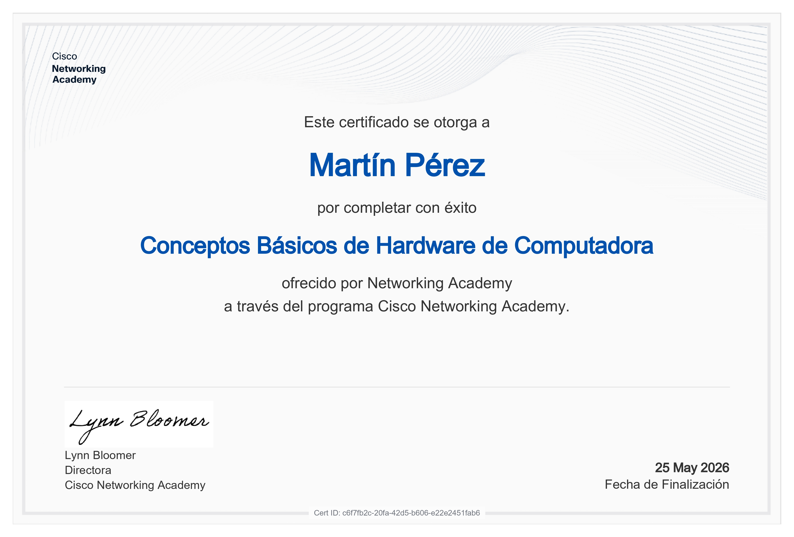

#+TITLE: Taller - Conceptos Básicos de Hardware y Ensamblaje de Computadores
#+SUBTITLE: ICCD332 Arquitectura de Computadores
#+AUTHOR: Santiago Proaño, Martín Pérez, Ariel Montufar, Damian Haro 
#+DATE: 26-05-2026
#+OPTIONS: toc:nil num:t
#+LANGUAGE: es

#+latex_class: article
#+latex_class_options:
#+latex_header:
#+latex_header_extra:
#+description:
#+keywords:
#+subtitle:
#+latex_footnote_command: \footnote{%s%s}
#+latex_engraved_theme:
#+latex_compiler: latexmk

#+latex_header: \usepackage{fancyhdr}
#+latex_header: \usepackage[top=25mm, left=25mm, right=25mm]{geometry}
#+latex_header: \usepackage{longtable}
#+latex_header: \fancyhead[R]{}
#+latex_header: \setlength\headheight{43.0pt}
#+LATEX_HEADER: \usepackage{tabularx}
#+LATEX_HEADER: \usepackage{longtable}

#+cite_export: biblatex
#+LATEX_HEADER: \usepackage[backend=biber, style=ieee]{biblatex}
#+BIBLIOGRAPHY: ../bibliography/bibliography.bib

#+begin_export latex
\fancyhead[C]{\includegraphics[scale=0.05]{../images/logoEPN.jpg}\\
ESCUELA POLITECNICA NACIONAL\\FACULTAD DE INGENIERIA DE SISTEMAS\\
ARQUITECTURA DE COMPUTADORES}
\thispagestyle{fancy}
#+end_export

* Instrucciones generales

  Este taller se realiza en *grupos*. Cada integrante debe completar
  individualmente el curso Cisco Networking Academy:
  *Conceptos Básicos de Hardware de Computadora* y obtener su
  certificado de completitud. 

  *Entregables del grupo:*
  - Resolución de éste archivo fuente ~.org~
  - El PDF exportado desde Emacs ~M-x org-latex-export-to-pdf~
  - Los certificados individuales de cada integrante (PDF o imagen)

  *Entregable Individual(Tarea):*
  -  Resolver el cuestionario individual en el aula virtual
** Recursos
Cree su usuario en la plataforma de /Cisco Networking Academy/. Use el
siguiente enlace:

[[https://www.netacad.com/es/courses/computer-hardware-basics?courseLang=en-US][Cisco Computer Hardware Basics]]

Puede configurar según el idioma de su preferencia. El texto está
disponible en Español. Los vídeos disponen de subtítulos en varios
idiomas.

* Parte A. Integrantes y certificados
Para insertar la captura del certificado utilice YASnippet: Escriba
~fig_~ seguido de ~C-TAB~. Esto produce ~#+caption~, ~#+attr_latex~ y
~#+label~ que permiten colocar un encabezado a la imagen, controlar el
escalado de la misma y una referencia. Finalmente inserte el enlace al
archivo usando ~C-c C-l~ o usando ~[[./carpeta-certificados/cert-int1.pdf]]~
1. *Integrante 1*
   - *Nombre completo:*
     Santiago Javier Proaño Yépez
   - *Correo:*
     santiago.proano01@epn.edu.ec
   - *Certificado adjunto:*
#+caption: Certificado Integrante 1
#+attr_latex: scale=0.5
#+label: fig:certificado-integrante-1
[[file:Certificados/ComputerHardwareBasicsUpdate20260526-30-crici5.pdf]]
2. *Integrante 2*
   - *Nombre completo:*
     Martín Pérez Reinoso
   - *Correo:*
     martin.perez02@epn.edu.ec
   - *Certificado adjunto:*
#+caption: Certificado Integrante 2
#+attr_latex: scale=0.5
#+label: fig:certificado-integrante-2
     
3. *Integrante 3*
   - *Nombre completo:*
     Damian Matias Haro Caceres
   - *Correo:*
     damian.haro@epn.edu.ec
   - *Certificado adjunto:*
#+caption: Certificado Integrante 3
#+attr_latex: scale=0.5
#+label: fig:certificado-integrante-3
[[file:Certificados/Computer_Hardware_Basics_certificate_damimati2000-gmail-com_9a630ea9-6aa1-438a-bd15-eeaa0d6d785a_Damian.pdf]]
4. *Integrante 4*
   - *Nombre completo:*
     Ariel Montufar Bermeo 
   - *Correo:*
     ariel.montufar@epn.edu.ec
   - *Certificado adjunto:*
#+caption: Certificado Integrante 4
#+attr_latex: scale=0.5
#+label: fig:certificado-integrante-4
[[file:Certificados/Computer_Hardware_Basics_certificate_arielmontufar-outlook-com_ec4f1618-2497-4071-83e2-f79c627792f7_Ariel_Montufar.pdf]]

* Parte B. Cuestionario argumentado grupal
Para cada pregunta:

- Indique la alternativa escogida (letra).
- Escriba una justificación técnica breve (3 a 6 líneas). Fundamente
  su respuesta. Su insumo principal es el curso de Conceptos Básicos
  de Hardware. Si usa otro material referenciar.
- Discuta con el grupo de trabajo las opciones y la respuesta ¿Existió
  consenso? ¿Cuáles fueron las principales discrepancias?

*Criterio:* correcto/incorrecto + calidad del argumento técnico.

** Pregunta 1
Al instalar una CPU en un socket LGA, ¿por qué es crítico alinear el
pin 1 de la CPU con el pin 1 del socket?

a. Para que el sistema arranque con mayor rapidez 

b. Para evitar daños en la CPU y el socket al insertar incorrectamente

c. Porque el pin 1 es el único que conduce electricidad 

d. Para que el disipador quede centrado automáticamente

- /Alternativa escogida:/ b
- /Justificación técnica:/ Porque al instalar el procesador en una orientación que no es la correcta, la presión del mecanismo puede llegar a doblar o romper de forma irreversible los pines expuestos del socket LGA, y dañar los puntos de contacto planos de la CPU, quedando inutilizables.
- /Debate del grupo:/ Se descartó la opción a, ya que la orientación no afecta la velocidad del software. La opción c tampoco es porque la mayoría de los pines conducen electricidad y datos. La d es incorrecta porque el centrado del disipador depende del sistema de anclaje de la placa base, no de la orientación. Entonces la opción b es la correcta.
** Pregunta 2
Al montar la placa madre en el gabinete, ¿cuál es la función de los separadores (standoffs)?

a. Sostener el peso de las tarjetas de expansión

b. Evitar cortocircuitos entre la placa madre y el metal del gabinete

c. Mejorar la ventilación de la placa madre

d. Facilitar la alineación del panel de E/S trasero

- /Alternativa escogida:/ b
- /Justificación técnica:/ La función de los separadores es evitar que la placa madre haga contacto directo con el gabinete, ya que la placa madre tiene soldaduras expuestas y el gabinete está hecho de metal conductor. Si ambos hicieran contacto directo, se generarían varios cortocircuitos. 
- /Debate del grupo:/ La opción a se descartó porque no están diseñados para soportar el peso de las tarjetas. La opción c y la opción d sonaban coherente, pero no es la función de los separadores, ya que la altura que generan los separadores ayuda indirectamente a la alineación, pero algunos gabinetes vienen con los separadores integrados, entonces se descartan. Queda la opción b como la correcta.

** Pregunta 3
Según el manual de ensamblaje de Cisco, ¿cuándo NO es necesario aplicar pasta térmica al instalar el disipador sobre la CPU?

a. Cuando la CPU es de alto rendimiento

b. Cuando el disipador ya incluye pasta térmica preaplicada

c. Cuando la CPU tiene más de un año de uso

d. Cuando el gabinete tiene buena ventilación

- /Alternativa escogida:/ b
- /Justificación técnica:/ Muchos disipadores modernos tienen con una capa de pasta térmica preaplicada de forma uniforme em su base. El añadir más pasta térmica es contraproducente, ya que ponerla en exceso crearía una barrera gruesa que dificultaría el paso del calor desde el procesador al disipador.
- /Debate del grupo:/ Se descartó la opción a porque las CPUs de alto rendimiento generan más calor y requieren pasta térmica de calidad. La opción c y la opción d no quitan que sea necesaria la pasta térmica. Además, en clase se vio un video correspondiente a esto, por lo que la respuesta era claramente la b.

** Pregunta 4
¿Por qué se recomienda usar pulsera antiestática y alfombrilla antiestática al manipular componentes internos?

a. Para proteger al técnico de descargas de 220 V

b. Para evitar que la electricidad estática dañe los componentes

c. Para cumplir una norma estética del laboratorio

d. Para que los tornillos no se magneticen

- /Alternativa escogida:/ b
- /Justificación técnica:/ Porque muchos de los componentes electrónicos internos (como CPU, RAM y placa madre) utilizan circuitos integrados que tienen semiconductores muy sensibles a una descarga electrostática, la cual se puede generar por el cuerpo humano al acumular miles de voltios de electricidad estática por fricción, causando que se daños instantáneos o fallas difíciles de identificar. 
- /Debate del grupo:/ Se descartó la opción a porque la pulsera antiestática no está hecha para proteger contra corrientes letales de 220V. La opción c tiene razón, pero no solo es una norma ni apariencia, está hecha con el fin de proteger a los componentes. La opción d es completamente falsa y no tiene nada que ver.
** Pregunta 5
Si al iniciar la computadora por primera vez un LED del panel frontal no funciona, ¿qué indica el manual de Cisco?

a. Reemplazar el conector por uno de repuesto

b. Revisar el BIOS para habilitar el LED

c. Quitar el conector, invertirlo y volver a conectarlo

d. Desconectar y reconectar la fuente de poder

- /Alternativa escogida:/ c
- /Justificación técnica:/ Según el manual de Cisco, los LED del panel frontal dependen de la polaridad correcta del conector. Si un LED no enciende al iniciar la computadora por primera vez, normalmente significa que el conector está invertido, por lo que la corriente no circula. La solución recomendada es retirarlo, girarlo y volverlo a conectar correctamente.
- /Debate del grupo:/ Se descartó la opción a porque el reemplazar un conector es una medida extrema que no resuelve nada si el LED simplemente está al revés. La opción b es incorrecta ya que la BIOS no controla directamente los LED básicos del panel frontal. Y la opción d no puede ser porque no corrige la polaridad de un conector específico del panel frontal.
** Pregunta 6
¿Por qué una GPU puede requerir un conector de alimentación PCIe adicional de la fuente de poder?

a. Porque la ranura PCIe no transmite señal de video

b. Porque las GPUs de alto rendimiento consumen más potencia de la que la ranura puede suministrar

c. Porque el conector PCIe solo funciona con tarjetas de red

d. Por el estándar de codificación de color de los cables SATA

- /Alternativa escogida:/ b
- /Justificación técnica:/ Las ranuras PCIe de la placa madre tiene un limite para el suministro de energía el cual no abastece a la tarjeta gráfica. Las GPU requieren mayor consumo para el procesamiento de gráficos por lo que es necesario conectar cables suplementarios desde la fuente de poder para cubrir eso.
- /Debate del grupo:/ Se descartó la opción a porque la ranura PCIe si transmite los datos para la señal de video. La opción c es incorrecta ya que el conector PCIe no solo funciona con tarjetas de red sino que también admite tarjetas de otros tipos. Y la opción d no es porque los cables SATA se usan en discos duros o SSDs y sus entandares de color no tienen nada que ver.
* Parte C. Mantenimiento de computadores

** 3.1 Insumos para mantenimiento preventivo
   Liste al menos seis insumos y describa para qué sirve cada
   uno. Revise el siguiente [[https://youtu.be/3ri1BMV7XTM?si=bjYoDUUKuMWwj4Qg][vídeo]].
  | Insumo                               | Uso principal                                                |
  |--------------------------------------+--------------------------------------------------------------|
  | Espátula plástica                    | Para separar y destrabar la carcasa plástica del equipo      |
  |                                      | sin rayar o marcar los componentes externos                  |
  | Aspiradora / Soplador                | Para retirar el polvo superficial acumulado y las pelusas    |
  |                                      | sueltas sobre el PCB y las tapas                             |
  | Alcohol isopropílico                 | Remover los restos de pasta térmica y masillas viejas        |
  | Papel para faginar (libre de pelusa) | Para limpiar superficies delicadas de los chips sin          |
  |                                      | dejar residuos (en conjunto con el alcohol isopropílico)     |
  | Espuma limpiadora                    | Remover la suciedad profunda y acumulada en áreas de         |
  |                                      | difícil acceso                                               |
  | Cepillo de cerdas suaves             | Remover polvo y residuos de compuestos térmicos              |
  |                                      | endurecidos entre pequeños componentes del PCB sin dañarlos  |
  | Cinta Kapton                         | Cinta resistente a altas temperaturas, se coloca para sellar |
  |                                      | la unión entre ventilador y disipador                        |
  | Pasta térmica y Thermal Putty        | Rellenan las imperfecciones microscópicas entre los chips    |
  |                                      | (CPU/GPU/VRAM) y el bloque metálico                          |
  |                                      |                                                              |

** 3.2 Procedimiento de limpieza — Desktop
   1. Apagar el equipo por completo, desconectar el cable de alimentación de la corriente eléctrica y retirar las tapas laterales del gabinete quitando los tornillos traseros.
   2. Utilizar aire comprimido o una aspiradora junto con un cepillo de cerdas suaves para quitar las acumulaciones de polvo del fondo del gabinete, rejillas de ventilación y sobre la superficie de los componentes principales.
   3. Sostener firmemente las aspas de los ventiladores para evitar que giren libremente y dañen sus ejes, limpiándolas de forma individual con un cepillo o paño húmedo.
   4. Desmontar con cuidado el disipador de calor de la CPU, limpiar la pasta térmica seca de las superficies con alcohol isopropílico y aplicar una nueva capa delgada de pasta térmica antes de volver a colocarlo.
   5. Reinstalar las tapas laterales asegurándolas con sus respectivos tornillos y limpiar el exterior del gabinete usando un paño de microfibra con espuma limpiadora para remover suciedad superficial.

** 3.3 Procedimiento de limpieza — Laptop
Depende de la laptop que se vaya a limpiar, se debe investigar previamente, pero en el video se usa una ASUS
   1. Retirar todos los tornillos de la tapa inferior y remover la tapa utilizando una espátula plástica para soltar las trabas de presión laterales de forma segura.
   2. Desconectar inmediatamente el flex de alimentación de la batería de la placa madre (PCB) para evitar cortocircuitos accidentales y realizar una aspiración inicial del polvo adherido en el área superficial.
   3. Retirar en orden los tornillos que fijan los tubos de cobre conductores y los ventiladores, desenchufando con sumo cuidado los delicados conectores eléctricos de los coolers antes de retirar el disipador.
   4. Limpiar las aspas de los ventiladores utilizando espuma limpiadora, cepillo y alcohol. Remover minuciosamente los residuos de pasta térmica y masilla vieja endurecida de los chips y el disipador empleando papel sin pelusa, para luego aplicar masilla térmica (thermal putty) en las memorias VRAM y pasta térmica de alta calidad sobre el procesador y chip gráfico.
   5. Volver a montar el bloque disipador ajustando los tornillos según el orden numérico grabado en el metal, reconectar la batería, cerrar a presión la tapa posterior con sus tornillos correspondientes y limpiar el teclado, pantalla y superficies exteriores usando un paño de microfibra y espuma con pH balanceado.
* Parte D. Aprendizaje obtenido

** Integrante 1 Santiago Proaño
   - *¿Qué conocimiento nuevo obtuvo del curso?* Aprendí la forma correcta de desamblar una computadora de escritorio sin dañar los componentes internos, cosa que para mi era una caja negra antes de realizar el curso, por lo que gracias a este curso tengo más confianza a la hora de intentar reparar o limpiar mi computadora de escritorio sin preocuparme por que no funcione luego.
   - *¿Qué concepto corrigió o clarificó?* Mejoré mi conocimiento en redes inalámbricas, mas específicamente en redes personales como las comunicaciones bluethooth, pues antes no tenia idea de que estas comunicaciones tenían una clasificación, y me preguntaba por que algunos de mis dispositivos tenían mas alcance que otros, ahora ya se el por que y en que rangos debería tener estos dispositivos. 

** Integrante 2  Martín Pérez
   - *¿Qué conocimiento nuevo obtuvo del curso?* El curso me permitió obtener mayor conocimiento sobre el ensamblaje y desensamblaje de una PC de manera muy detallada, con tutoriales paso a paso, algunos cuidados que se deben tener con los componentes y herramientas útiles para esto. Además, conocí mucho más del hardware de los dispositivos portátiles, celulares, relojes inteligentes y otros dispositivos más. Sin olvidar los protocolos de seguridad y prevención de incendios.
   - *¿Qué concepto corrigió o clarificó?* Clarifiqué mi enfoque acerca del mantenimiento que se debe tener con los dispositivos que usamos a diario y cómo limpiarlos de manera superficial. Me hizo darme cuenta de lo diferentes que son las arquitecturas físicas para cada dispositivo dependiendo de su uso y en qué ambientes se los requiere o usa mayormente.

** Integrante 3 (Damián Haro)
   - *¿Qué conocimiento nuevo obtuvo del curso?* Este curso sobre el hardware fue fructífero para la obtención de nueva información sobre el ensamblaje y desamblaje de dispositivos portátiles y su adecuado mantenimiento, incluyendo información sobre otros muchos dispositivos que aportan un distinto uso en la vida cotidiana.
   - *¿Qué concepto corrigió o clarificó?* Este curso pudo resolver mi duda principalmente sobre distintos elementos dentro de una computadora portatil y su gran importancia, junto con hacer darme cuenta que es mucho más complejo su mantenimiento y limpieza de lo que consideraba inicialmente

** Integrante 4 (Ariel Montufar)
   - *¿Qué conocimiento nuevo obtuvo del curso?* El curso me fue util para comprender el funcionamiento y componentes de los distintos dispositivos móviles que son comúnmente usados especialmente por aquellos que seguimos la carrera de software. Tambien fue posible rellenar lagunas sobre conocimientos que estaban incompletos. Por último aprendí de los riesgos que puede conllevar manejar los componentes internos de estos dispositivos si no se maneja con el debido cuidado.
   - *¿Qué concepto corrigió o clarificó?* Corregí sobre el cuidado que conllevan los dispositivos pues lo tenia muy a la ligera y no manipulaba estos con la debida delicadeza. Clarifique que si no se tratan con cuidado ni se usan las herramientas adecuadas puede terminar averiándose el dispositivo. Además de que existen productos diseñados específicamente para la limpieza de estos componentes tecnológicos.
     
* Rúbrica de evaluación

  | Criterio                               | Puntaje máximo |
  |----------------------------------------+----------------|
  | Certificados individuales completos    |             20 |
  | Cuestionario: respuesta correcta (x8)  |             30 |
  | Cuestionario: argumento técnico (x8)   |             30 |
  | Mantenimiento (tabla + procedimientos) |             20 |
  | TOTAL                                  |            100 |

* ¿Cómo referenciar en Emacs?
Para insertar una referencia a un recurso bibliográfico
1. Puede actualizar el archivo ~../bibliography/bibliography.bib~
2. Escribir en formato **BibTeX** el recurso bibliográfico
3. Verifique la siguiente configuración al encabezado:
   #+begin_src org
   #+cite_export: biblatex
   #+LATEX_HEADER: \usepackage[backend=biber, style=ieee]{biblatex}
   #+BIBLIOGRAPHY: ../bibliography/bibliography.bib
   #+end_src
4. Usar ~M-x org-cite-insert~ para insertar una cita. Aparecerá una
   lista. Use los cursores para seleccionar la cita. Ejecute ~C-RET~: /De acuerdo con
   [cite:@ledin2022modern], la arquitectura ...../
5. Revise que al final del documento exista ~#+print_bibliography:~
6. **Sugerencia:** Para evitar repetir varias veces el proceso de
   exportación, es recomendable cambiar el compilador de \LaTeX a
   ~latexmk~. Para esto:
   - ~sudo apt install latexmk~
   - Revise en el encabezado del ~.org~ que el compilador escogido sea
     ~#+LATEX_COMPILER: latexmk~. También puede modificar el archivo
     ~init.el~ para indicar qué compilador se usa para exportar de
     ~.org~ a /LaTeX/:
     #+begin_src elisp
;; 4.7b Proceso de compilación con latexmk para Org-export
(with-eval-after-load 'ox-latex
  (setq org-latex-pdf-process
        '("latexmk -f -pdf -%latex -interaction=nonstopmode -output-directory=%o %f")))

;; 4.7c Org-cite: biblatex como procesador para exportación LaTeX
(with-eval-after-load 'oc
  (setq org-cite-export-processors
        '((latex biblatex)
          (t basic))))

     #+end_src
* Verificación de Entregables [100%]:
Ejecute ~C-c C-c~ sobre los ítems de tarea según se hayan cumplido o
no. Si un ítem no pudo realizarse apunte en la siguiente sección las
razones al respecto.
- [X] Los enlaces a los certificados en el documento ~.org~ funcionan.
- [X] Resolución completa del Cuestionario2.
- [X] Revisión del vídeo sobre mantenimiento a computador ASUS. 
- [X] Tutorial de Comandos Emacs realizado.
- [X] Lista de insumos para mantenimiento completa.
- [X] Procedimiento de mantenimiento para desktop completo.
- [X] Procedimiento de mantenimiento para laptop completo.
- [X] Revisión de ortografía con ~ispell-buffer~ en el buffer
- [X] Generación de Archivo PDF ~M-x org-latex-export-to-pdf~
- [X] Subir al aula virutal archivo ~.org~ y ~.pdf~

#+print_bibliography:
